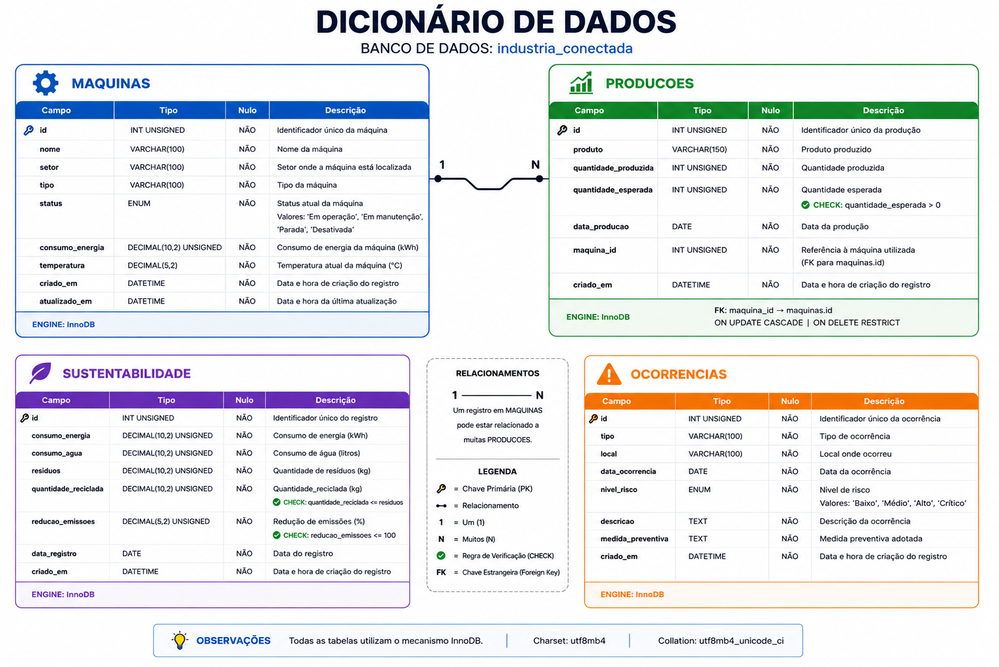

# Indústria Conectada

Sistema de Monitoramento e Gestão Industrial desenvolvido como Projeto Integrador do Curso Técnico em Informática para Internet.

## Sobre o projeto

O Indústria Conectada é uma aplicação web criada para centralizar e gerenciar informações do ambiente industrial. O sistema permite monitorar máquinas, acompanhar a produção e visualizar indicadores que auxiliam na tomada de decisões.

A proposta busca substituir controles feitos em planilhas e documentos separados por uma solução integrada, organizada e de fácil utilização.

## Objetivo

Desenvolver uma aplicação Full Stack para monitoramento e gestão de processos industriais, aplicando conceitos de Desenvolvimento Web, Banco de Dados, APIs REST, versionamento e Indústria 4.0.

## Tecnologias utilizadas

- HTML5
- CSS3
- JavaScript
- GSAP
- Node.js
- Express
- MySQL
- MySQL Workbench
- Git e GitHub

## Funcionalidades planejadas

- Dashboard com indicadores
- Cadastro, consulta, edição e exclusão de máquinas
- Controle de produção
- Indicadores de sustentabilidade
- Interface responsiva e acessível
- Integração com API REST e banco de dados

## Estrutura do projeto

- `frontend/`: páginas, estilos, scripts e imagens da interface
- `backend/`: API, rotas, controladores e configuração do servidor
- `database/`: scripts de criação e população do banco MySQL
- `documentacao/`: escopo, protótipos e demais documentos do projeto

## Arquitetura

Usuário → HTML, CSS e JavaScript → API Node.js/Express → MySQL

## Modelagem do banco de dados

O banco de dados `industria_conectada` possui as entidades Máquinas, Produções, Sustentabilidade e Ocorrências. Uma máquina pode estar relacionada a vários registros de produção.

Documentação técnica:

- [Diagrama Entidade-Relacionamento](documentacao/der.md)
- [Dicionário de dados](documentacao/dicionario-dados.md)
- [Script de criação do banco](database/schema.sql)
- [Dados iniciais para testes](database/seed.sql)

## Como executar

Nesta etapa, abra o arquivo `frontend/index.html` no navegador ou utilize a extensão Live Server do Visual Studio Code.

As instruções do Back-End e do banco de dados serão adicionadas durante o desenvolvimento.

## Desenvolvedor

Projeto desenvolvido por João como parte do Projeto Integrador do Curso Técnico em Informática para Internet.
